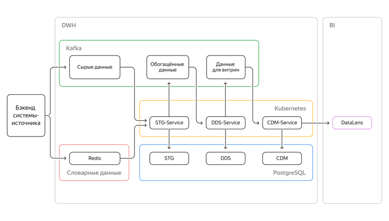

# Проект 9-го спринта

Создание и настройка сервиса получения и обогащения данных о ресторанах, клиентах и заказах с помощью Redis, брокера сообщений Kafka
хранение данных в PostgreSQL и размещение сервиса в облаке с помощью Kubernates

Схема проекта

Три сервиса. По одному сервису на слой.
Каждый сервис читает поток данных из Kafka и формирует свой слой данных.
Название сервисов: 
    STG-Service,
    DDS-Service,
    CDM-Service.
Брокер сообщений как на вход, так и для обмена данными между сервисами — Kafka.
Дополнительно для визуализации данных используется дашборд DataLens.

STG слой получает данные как они есть
DDS слой выполнен как модель данных Data Vault.
CDM слой содержит две витрины:
    первая — счётчик заказов по блюдам; 
    вторая — счётчик заказов по категориям товаров.

